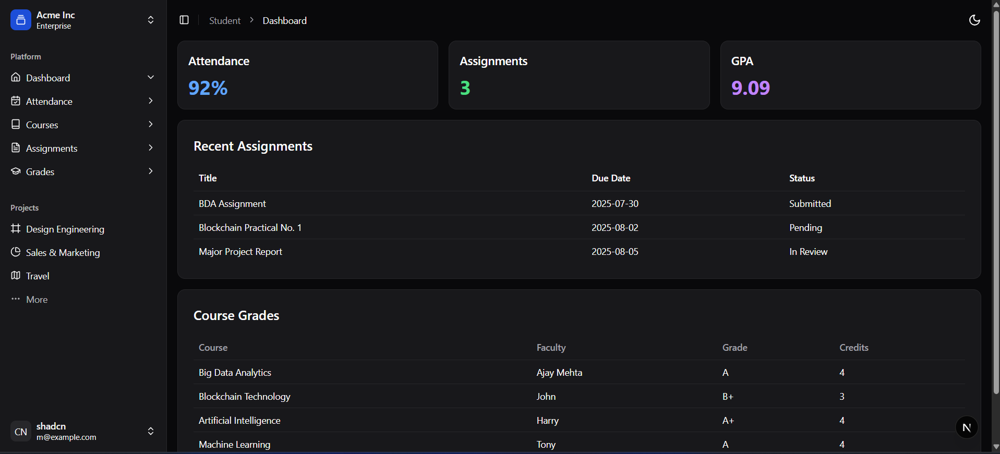

# Student Dashboard

A responsive and modern student dashboard built with **Next.js**, **Tailwind CSS**, and **ShadCN UI**.

## Installation & Setup

1. **Clone the repository**:

```bash
git clone https://github.com/pallavibandarkar/Student_Dashboard.git
cd Student_Dashboard
```

2. npm install
3. Run the development server:
   npm run dev



```
Open [http://localhost:3000](http://localhost:3000/dashboard) with your browser to see the result.
```
